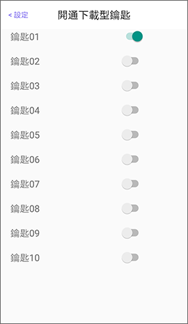

# 開通分享鑰匙

鎖具完成啟用與建立離線鑰匙後，擁有管理者鑰匙權限的使用者，在APP登入PHONEKEY帳號、手機連網且與鎖具連線的狀態下，可開通「下載型鑰匙 \(最多可設定10組\)」或「線上型鑰匙」。

* 若管理者A已經開通某一把下載型鑰匙，管理者B可先關閉該鑰匙再重新開通，該鑰匙的分享權利將歸給管理者B。
* 若管理者關閉了某一把下載型鑰匙，該鑰匙將被清除而無法使用。
* 若管理者將線上型鑰匙的狀態由啟用改為關閉，所有已設定的線上型鑰匙將被清除。

## 1. 進入裝置設定 

從裝置列表尋找要設定的鎖具，向左滑動並進入裝置設定\(齒輪圖示\)。

 

## 2. 開通分享鑰匙 

選擇開通**下載型鑰匙**\(離線使用\)或**線上型鑰匙**\(連網使用\)。

* 每把下載型鑰匙僅能給一個帳號使用。
* 點選鑰匙可修改該鑰匙名稱。
* 已開通的下載型鑰匙才會顯示在分享鑰匙列表。

 

