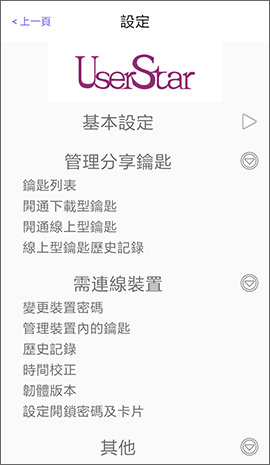
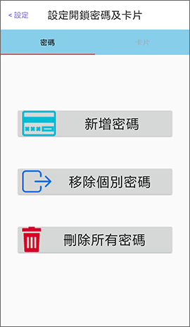
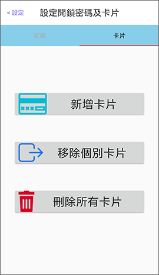

# 藍牙門鎖

完成門鎖啟用與建立離線鑰匙後，請在設定頁面&gt;**需連線裝置**，點選「設定開鎖密碼及卡片」。

此操作需具有管理者鑰匙權限。

## 密碼

密碼應為數字且長度為6碼，最多可設定10組密碼。

可從此頁面新增密碼、管理密碼或刪除所有密碼。

## 卡片

請使用 MIFARE 感應卡片 \(ISO14443A/ 13.56 MHz，例如悠遊卡\) 進行設定，最多可設定30張卡片。

可從此頁面新增卡片、管理卡片或刪除所有卡片。

 

