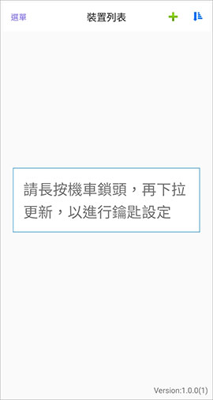
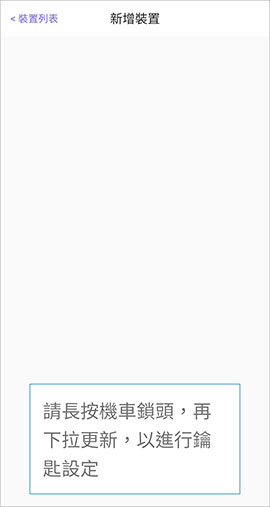
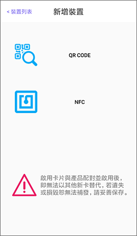
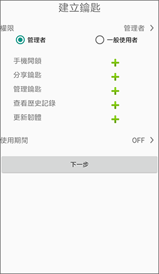
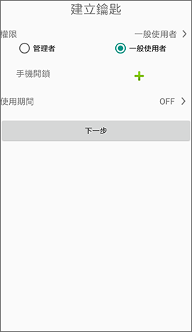
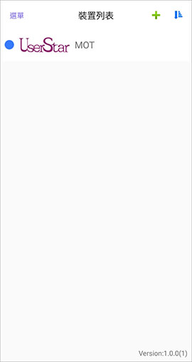
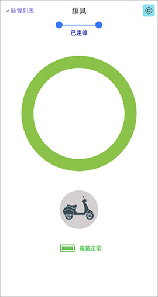
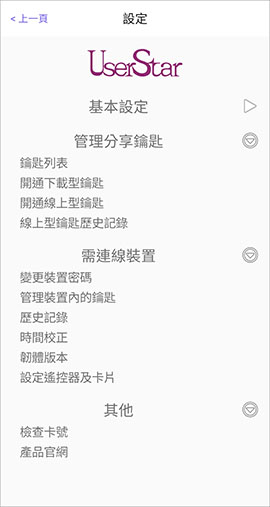
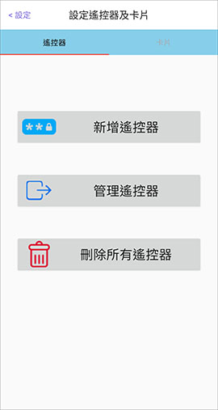
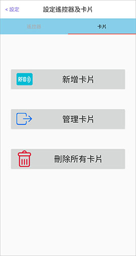

# 藍牙機車鎖

在裝置列表或\(+\)新增裝置的頁面裡，先長按機車鎖頭按鈕，再下拉APP畫面進行啟用鎖具與建立離線鑰匙。

啟用鎖具–將手機相機對準保證卡的二維碼、或使用NFC手機讀取保證卡，然後設定裝置密碼。 

建立離線鑰匙－使用裝置密碼，建立離線鑰匙（管理者、一般使用者）。

完成建立離線鑰匙後，從裝置列表選取該鎖具項目進入鎖具頁面，緣色圓圈為開鎖按鈕、機車小圖示為尋車按鈕。

完成建立離線鑰匙後，請在設定頁面&gt;需連線裝置，點選「**設定遙控器及卡片**」。 

此操作需具有管理者鑰匙權限。

## 遙控器 

可從此頁面新增遙控器、管理遙控器或刪除所有遙控器。 

執行「新增遙控器」，待遙控器指示燈亮起後，請長按遙控器按鈕3秒，待指示燈熄滅後放開。 

執行「管理遙控器」，向左滑動所選項目，修改遙控器的預設名稱。

## 卡片 

可從此頁面新增卡片、管理卡片或刪除所有卡片。 

請使用 PHONEKEY防偽標籤 \(ISO 15693, 13.56MHz\) 進行設定。

